# Scorer benchmarking — complete report

Comprehensive record of EPP scorer experiments on the `guygir` **`mm-scorer-lc`** stack (4× vLLM, Qwen2-VL-2B). Covers **VisionArena** replay workloads and the latest **synthetic `shared_prefix`** llm-d classical compare.

**Related deep dives:** [LATENCY_COST_SCORER.md](LATENCY_COST_SCORER.md) · [MM_SCORER_WEIGHT_PROFILE_BENCHMARK.md](MM_SCORER_WEIGHT_PROFILE_BENCHMARK.md) · [QUEUE_TUNING_ANALYSIS.md](QUEUE_TUNING_ANALYSIS.md) · [LATENCY_CALIBRATION_NOTES.md](LATENCY_CALIBRATION_NOTES.md)

**PR / implementation:** multimodal + latency-cost work on branch `latency-cost-scorer` in `llm-d-inference-scheduler`; MM scorer PR #901 is separate — hold review until Rahul finishes commits.

---

## Table of contents

1. [Executive summary](#1-executive-summary)
2. [Scorers under test](#2-scorers-under-test)
3. [Cluster stack and methodology](#3-cluster-stack-and-methodology)
4. [Workload families](#4-workload-families)
5. [Campaign index](#5-campaign-index)
6. [VisionArena benchmarks](#6-visionarena-benchmarks)
7. [Latency-cost calibration and queue tuning](#7-latency-cost-calibration-and-queue-tuning)
8. [Synthetic shared_prefix compare (llm-d classical)](#8-synthetic-shared_prefix-compare-llm-d-classical)
9. [Configuration reference](#9-configuration-reference)
10. [Reproducibility](#10-reproducibility)
11. [Recommendations](#11-recommendations)
12. [Figure index](#12-figure-index-all-pngs)

---

## 1. Executive summary

| Question | Answer |
|----------|--------|
| Best **static** VisionArena profile @ 20 RPS? | No single ratio — **`2:1`**, **`8:1`**, or **`only precise`** win depending on trace; precise-heavy is the robust 20 RPS theme. |
| Best under **saturation** (30–40 RPS)? | **`latency-cost-scorer`** — often **orders of magnitude** lower e2e latency than static `max-score-picker` profiles on heavy VA traces. |
| Does latency-cost “cheat” with future requests? | **No** — per-request signals only (prefix/MM match + queue depth). Fixed JSONL order is harness repeatability, not scorer input. |
| Is KV moved pod-to-pod? | **No** — local vLLM prefix cache per replica; EPP picks the pod that already has affinity. No P2P / PD KV transfer in these runs. |
| Latest classical compare? | **`shared_prefix` synthetic** @ 2000+400+500 tokens, **88.9%** success; **latency-cost** slightly better TTFT than **precise-only** above ~35 QPS. |

---

## 2. Scorers under test

| Scorer | Role | Picker |
|--------|------|--------|
| **`precise-prefix-cache-scorer`** | Ranks endpoints by prefix-cache match for the current request | `max-score-picker` (weight 1) |
| **`weighted-mm-embeddings-cache-scorer`** | MM cache score + configurable weight vs precise | `max-score-picker` |
| **`mm-embeddings-cache-scorer`** | Unweighted MM cache only | `max-score-picker` |
| **`latency-cost-scorer`** | Predicted **TTFT cost** = base + uncached text + uncached MM + queue depth; **lowest cost → highest score** | `max-score-picker` (weight 1) |

**Ratio notation:** `precise:MM` (e.g. `8:1` = precise weight 8, MM weight 1). **`only precise` / `only weighted` / `only unweighted`** = sole active scorer (no zero-weight placeholder).

**Latency-cost v1 coefficients** (post calibration, `epp-latency-cost.yaml`):

```yaml
baseMs: 120
textMsPerUncachedToken: 2
mmMsPerUncachedUnit: 175
queueMsPerRequest: 100   # B.1 tested 200; B.3 tested 250
```

---

## 3. Cluster stack and methodology

| Item | Value |
|------|--------|
| Namespace | `guygir` |
| Model deploy | `mm-scorer-lc-model` — **4 replicas**, **TP=1**, **1 GPU** each |
| Model | `Qwen/Qwen2-VL-2B-Instruct`, `--max-model-len 4096` |
| Gateway | `mm-scorer-lc-envoy:8081` |
| EPP | `mm-scorer-lc-epp` + `mm-scorer-lc-config` |
| Results PVC | `kv-cache-pvc-test-100gb` → `/requests` |
| Harness | `ghcr.io/llm-d/llm-d-benchmark:v0.5.2` / `inference-perf` |

**Cache / KV behavior**

- **vLLM prefix caching** is **per pod** (GPU-local).
- EPP **`precise-prefix-cache-scorer`** uses a **local prefix indexer**; benchmark config has `kvEventsConfig.zmqEndpoint: ""` — **not** the classical ZMQ KV-events fabric to `gaie-*-epp`.
- **No peer-to-peer KV transfer** between pods; **no prefill/decode disaggregation** in this stack.
- Between scorer A/B runs: HTTP **`reset_prefix_cache`**, **`reset_mm_cache`**, **`reset_encoder_cache`** on **each** model pod IP.

**Two benchmark methodologies**

| Method | Used in | Model pods between cells |
|--------|---------|-------------------------|
| **Cache-reset only** | Sole-scorer RPS grid | Same 4 pods, HTTP reset |
| **Model restart per VA variant** | VA LC sweeps (`va-lc-20/40`) | Rollout wait per profile variant |

Compare absolute seconds across methodologies with care.

---

## 4. Workload families

### 4.1 VisionArena (primary)

- **Source:** VisionArena-derived JSONL replays on PVC (e.g. `va_t2_ordered_mt512.jsonl`).
- **Multimodal:** images + chat; uses **token-producer** + `/render` + MM + prefix scorers.
- **Profiles:** `va_t2_*`, `va_t4_*`, `va_t6_*` — varying turns, `max_tokens` (256/512), ordered vs shuffled.
- **Typical bench:** 20 or 40 RPS, 180s window + warmup, 4 model pods.

### 4.2 Synthetic controls (secondary)

- **RandomMM**, **DocVQA-derived**, **Academic-derived** — used in early ratio sweeps; good for stress/reuse patterns, **not** for picking production MM weights alone.

### 4.3 Synthetic shared_prefix (llm-d classical)

- **Harness type:** `shared_prefix` — **fully synthetic** token lengths (no real trace).
- **Config:** 150 groups × 5 prompts/group; **2000** system + **400** question + **500** output tokens (fixed from 6000+1200+1000 after 400 failures).
- **Text-only** completions (`enable_multi_turn_chat: false`) on a VL-capable model.
- **Load:** Poisson warmup 15 RPS × 50s + RPS ladder **3 → 60** (17 stages), same shape as [llm-d precise-prefix guide](https://github.com/llm-d/llm-d/tree/main/guides/precise-prefix-cache-aware).
- **Not comparable** to published **8× Qwen3-32B** classical baseline (see §8.3).

---

## 5. Campaign index

| Run ID | Workload | RPS / load | Scorers compared | Key artifacts |
|--------|----------|------------|------------------|---------------|
| `20260517-060043` | 8 mixed (incl. VA) | 20 | Weighted MM ratios | [§6.1](#61-weighted-mm-ratio-sweep-mixed-workloads) |
| `20260517-unweighted-190505` | 8 mixed | 20 | Unweighted MM ratios | [§6.2](#62-unweighted-mm-ratio-sweep) |
| `20260518-va-weighted-parallel` | 8 VA profiles | 20 | Weighted ratios | [§6.3](#63-visionarena-only-20-rps) |
| `20260518-va-unweighted-parallel` | 8 VA profiles | 20 | Unweighted ratios | [§6.3](#63-visionarena-only-20-rps) |
| `20260518-va-weighted-40rps` | 6 VA profiles | 40 | Weighted ratios | [§6.4](#64-visionarena-only-40-rps) |
| `20260518-va-unweighted-40rps` | 6 VA profiles | 40 | Unweighted ratios | [§6.4](#64-visionarena-only-40-rps) |
| `20260519-latency-cost-30rps` | `va_t4_ordered_mt512` | 30 | Sole scorers table | [MM doc §5](MM_SCORER_WEIGHT_PROFILE_BENCHMARK.md) |
| `20260519-sole-scorer-va-t2-rps` | `va_t2_ordered_mt512` | 10–40 grid | 4 sole scorers | [§6.5](#65-sole-scorer-rps-grid) |
| `20260519-lc-calibration-va-t2-rps` | `va_t2_ordered_mt512` | 5–50 | v0 vs v1 coeffs | [§7.1](#71-coefficient-calibration) |
| `20260519-va-lc-20rps` | 8 VA profiles | 20 | LC vs static ratios | [§6.6](#66-latency-cost-vs-static-ratios) |
| `20260519-va-lc-40rps` | 8 VA profiles | 40 | LC vs static ratios | [§6.6](#66-latency-cost-vs-static-ratios) |
| `20260520-lc-queue-tuning` | `va_t2_ordered_mt512` | 5–50 | v1 / B.1 / B.2 | [§7.2](#72-queue-coefficient-tuning) |
| `20260520-llmd-scorer-compare` | `shared_prefix` synthetic | 3–60 ladder | `only_precise` vs `latency_cost` | [§8](#8-synthetic-shared_prefix-compare-llm-d-classical) |

---

## 6. VisionArena benchmarks

### 6.1 Weighted MM ratio sweep (mixed workloads)

**Run:** `20260517-060043` · **20 RPS** · weighted MM + precise ratios + endpoint-only baselines.

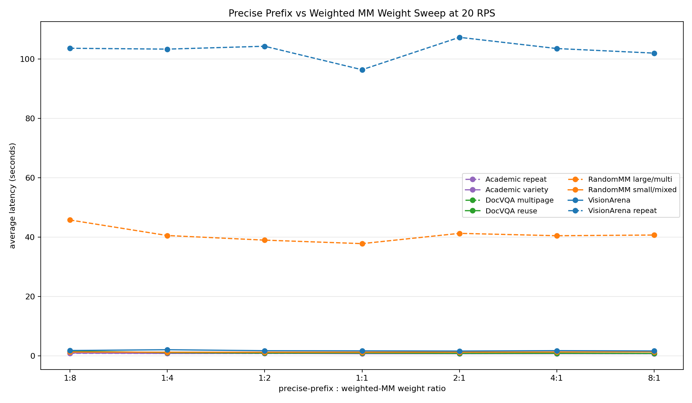

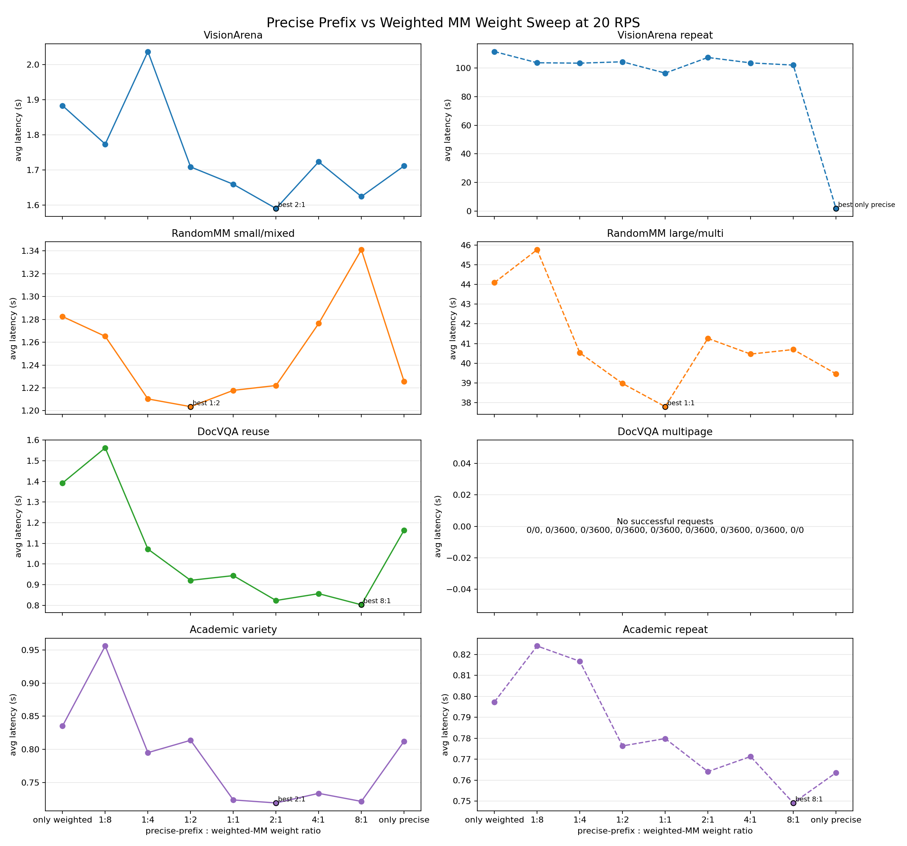

**Takeaway:** On real VA baseline, **`2:1`** was best avg latency; repeat-heavy VA favored **`only precise`**. Synthetic DocVQA/Academic often favored **`8:1`**. No universal ratio.

---

### 6.2 Unweighted MM ratio sweep

**Run:** `20260517-unweighted-190505` · **20 RPS**.

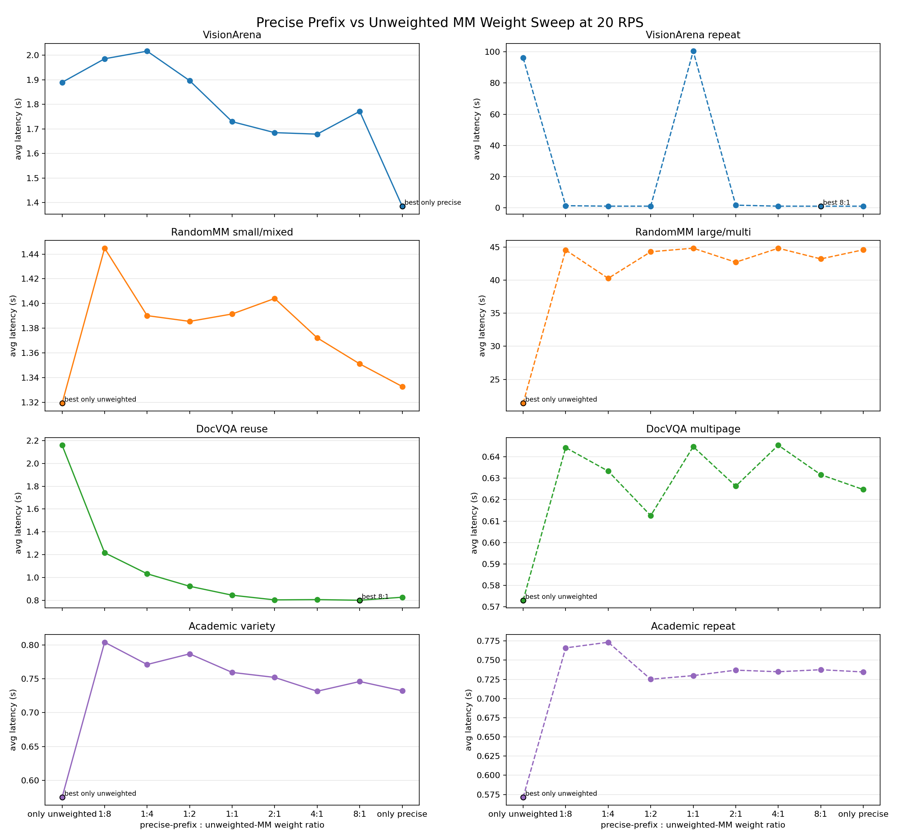

**Takeaway:** VA baseline favored **`only precise`**; many synthetic cells favored **`only unweighted`** (often **without** token-producer/render — not apples-to-apples vs mixed profiles).

---

### 6.3 VisionArena-only @ 20 RPS

**Runs:** `20260518-va-weighted-parallel`, `20260518-va-unweighted-parallel`.

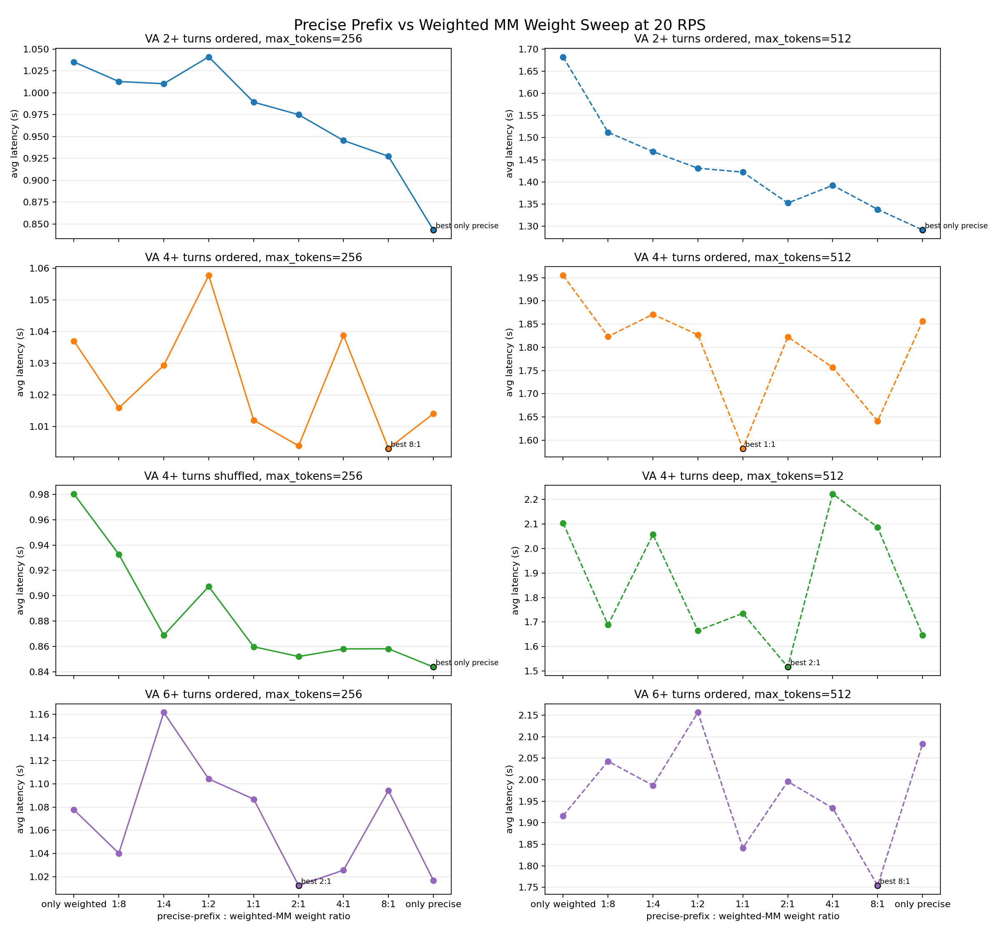

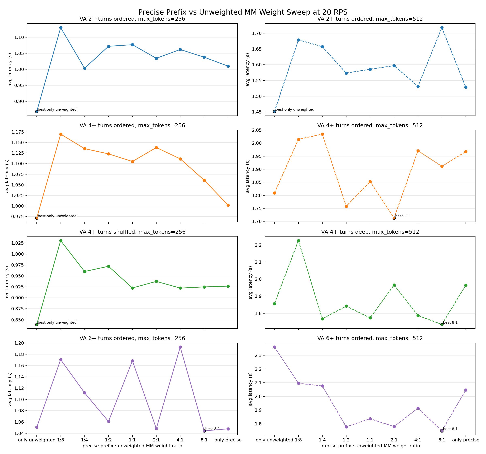

| MM type | Winners across 8 VA profiles |
|---------|------------------------------|
| Weighted | `only precise` (3), `2:1` (2), `8:1` (2), `1:1` (1) |
| Unweighted | `only unweighted` (4), `8:1` (3), `2:1` (1) |

**Production-ish @ 20 RPS:** **`2:1` or `8:1`** with precise prefix; keep **`only precise`** as baseline.

---

### 6.4 VisionArena-only @ 40 RPS

**Runs:** `20260518-va-weighted-40rps`, `20260518-va-unweighted-40rps` (6 profiles each; `va_t6_ordered_mt256` failed on unweighted 40 RPS lane).

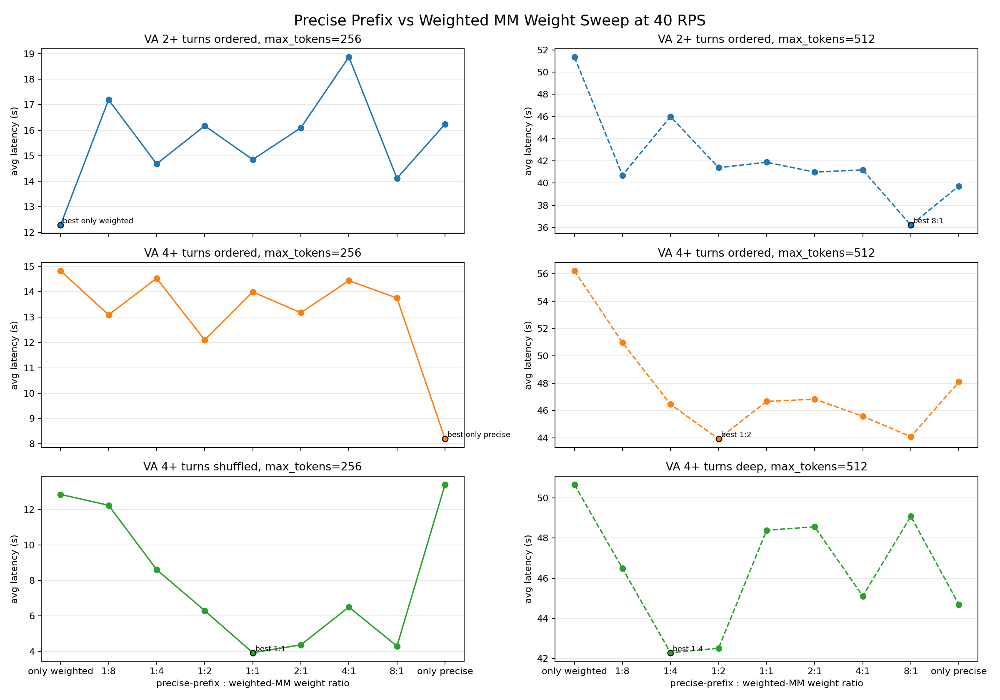

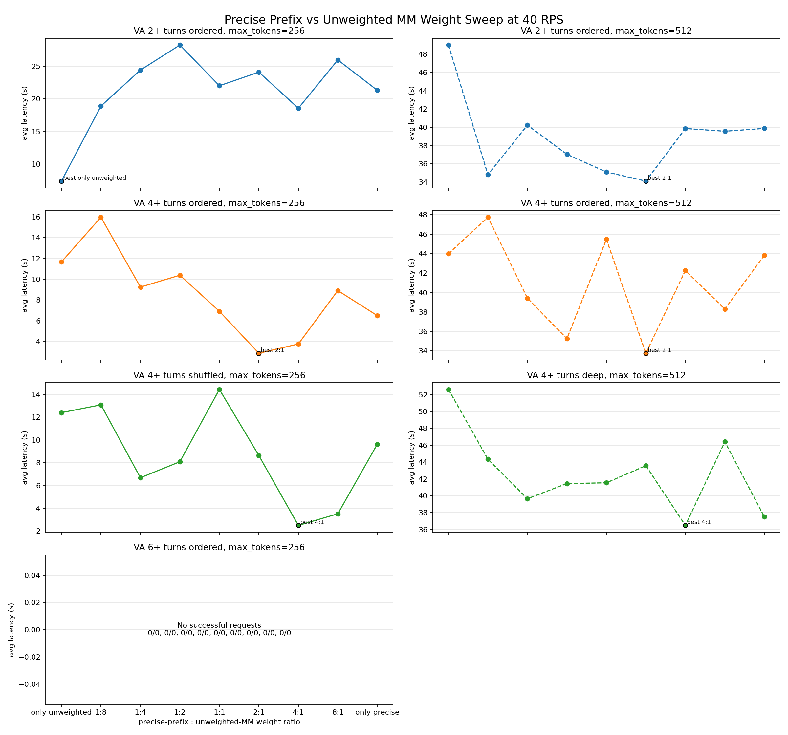

**Takeaway:** Under saturation, **no single ratio wins** — winners split across precise-heavy, MM-heavy, and endpoint-only profiles. Latencies **~10–40×** vs 20 RPS. Use 40 RPS to study overload, not to pick one static weight.

---

### 6.5 Sole-scorer RPS grid

**Run:** `20260519-sole-scorer-va-t2-rps` · workload **`va_t2_ordered_mt512`** · RPS **10 / 20 / 30 / 40** · cache-reset-only between cells · ~**2h14m** wall clock.

**Mean e2e latency (s)**

| Profile | 10 RPS | 20 RPS | 30 RPS | 40 RPS |
|---------|-------:|-------:|-------:|-------:|
| `only_precise` | 16.8 | 134.2 | 237.6 | 365.1 |
| `only_weighted` | 17.6 | 134.0 | 201.3 | 339.1 |
| `only_unweighted` | 9.3 | 110.5 | 224.9 | 298.0 |
| **`latency_cost`** | **1.2** | **1.5** | **10.5** | **40.3** |

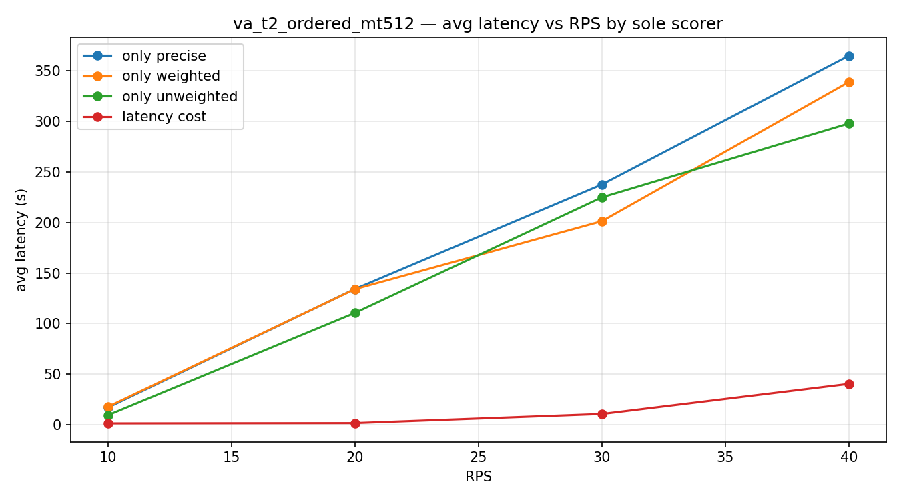


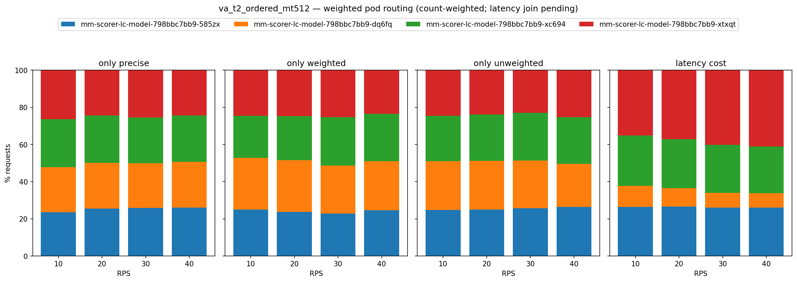

**Routing:** Static scorers ≈ **25%** per pod. **`latency_cost`** shifts load off **`dq6fq`** (~8–11%) onto **`xtxqt`** (~35–41%) as RPS rises — queue-aware feedback, not uniform spread.

---

### 6.6 Latency-cost vs static ratios

**Runs:** `20260519-va-lc-20rps`, `20260519-va-lc-40rps` · 8 VA profiles × profiles `{latency cost, 1:0, 4:1, 1:1, 1:4, 0:1}`.

**@ 20 RPS** — latency-cost competitive or best on most profiles (e.g. `va_t2_ordered_mt512` **~1.07s** vs **~1.24s** for `1:0`).

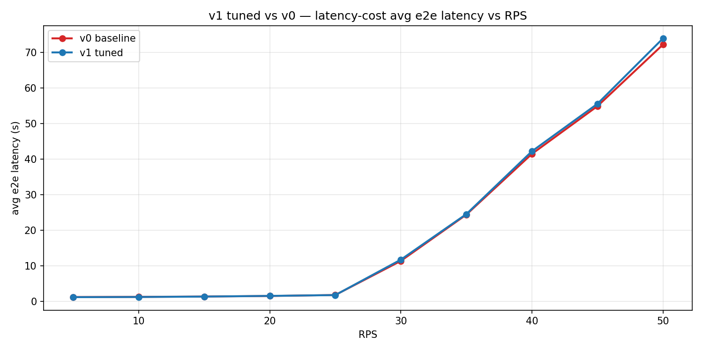

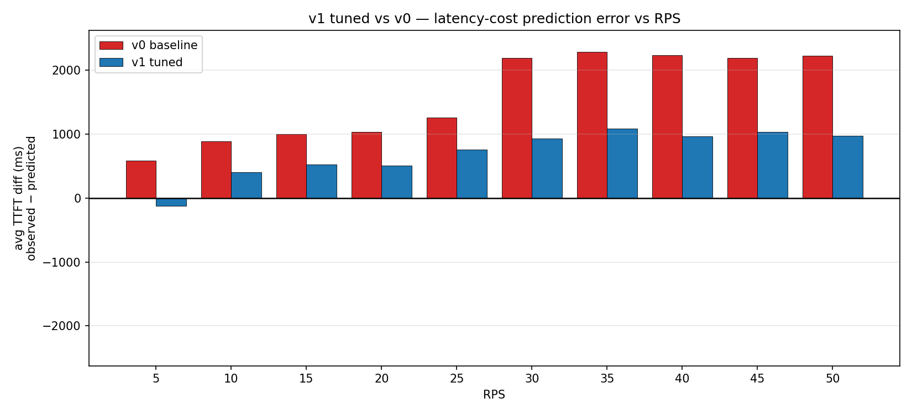

**@ 40 RPS** — latency-cost often **orders of magnitude** faster on heavy traces (e.g. `va_t2_ordered_mt512`: **~42s** vs **~364s** for `1:0`); light traces (e.g. `va_t4_ordered_mt256`) stay ~**1.2s** vs seconds–minutes for static ratios.

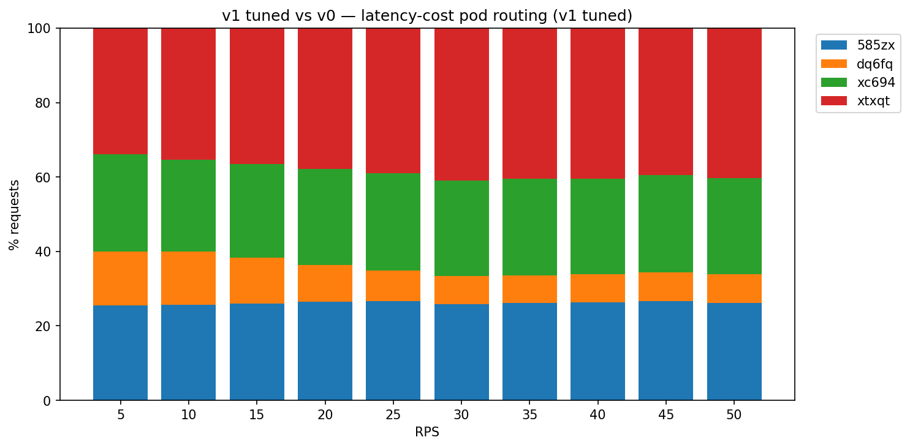

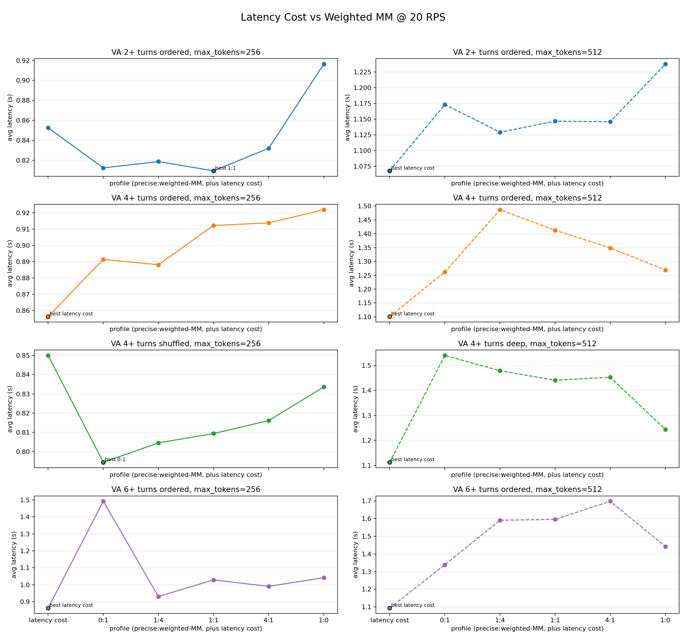

Full tables: [20 RPS summary](results/20260519-va-lc-20rps/artifacts/summary.md) · [40 RPS summary](results/20260519-va-lc-40rps/artifacts/summary.md).

---

## 7. Latency-cost calibration and queue tuning

### 7.1 Coefficient calibration

**Goal:** Align **predicted TTFT** (`latency-cost-scorer`) with **observed TTFT** (`latency-observer` logs) — not directly optimize e2e latency.

**Runs:** `20260519-lc-calibration-va-t2-rps` (v0 baseline coeffs) · `20260520-lc-calibration-tuned` (v1 coeffs) · workload `va_t2_ordered_mt512`.

| Parameter | v0 | v1 |
|-----------|---:|---:|
| `baseMs` | 0 | 120 |
| `textMsPerUncachedToken` | 1 | 2 |
| `mmMsPerUncachedUnit` | 100 | 175 |
| `queueMsPerRequest` | 50 | 100 |

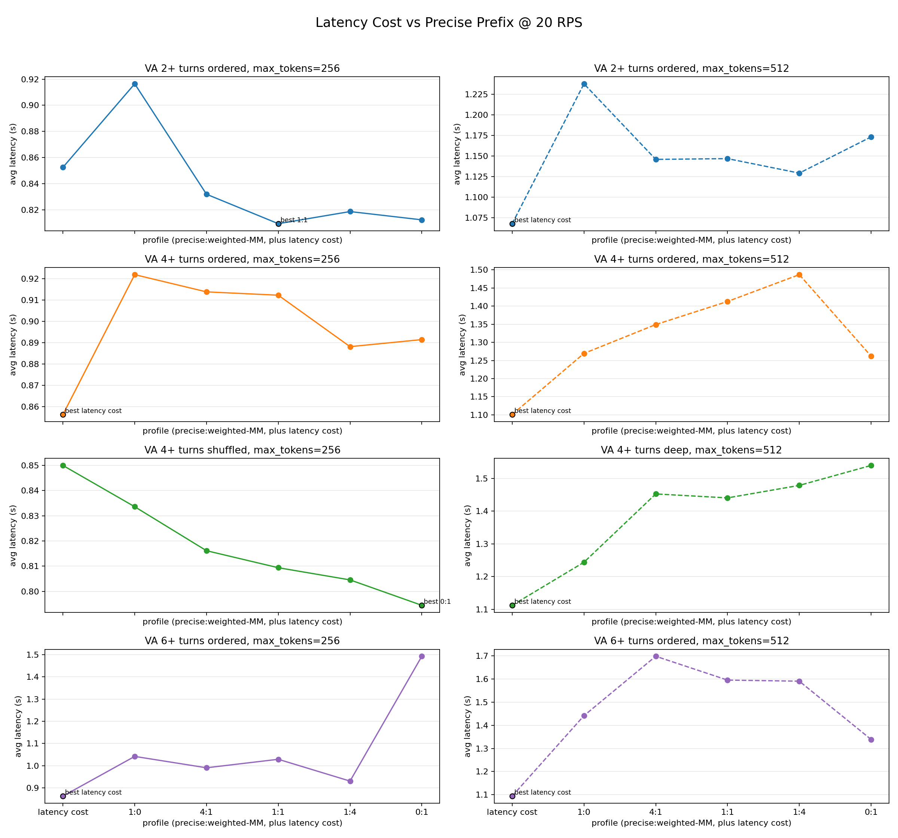

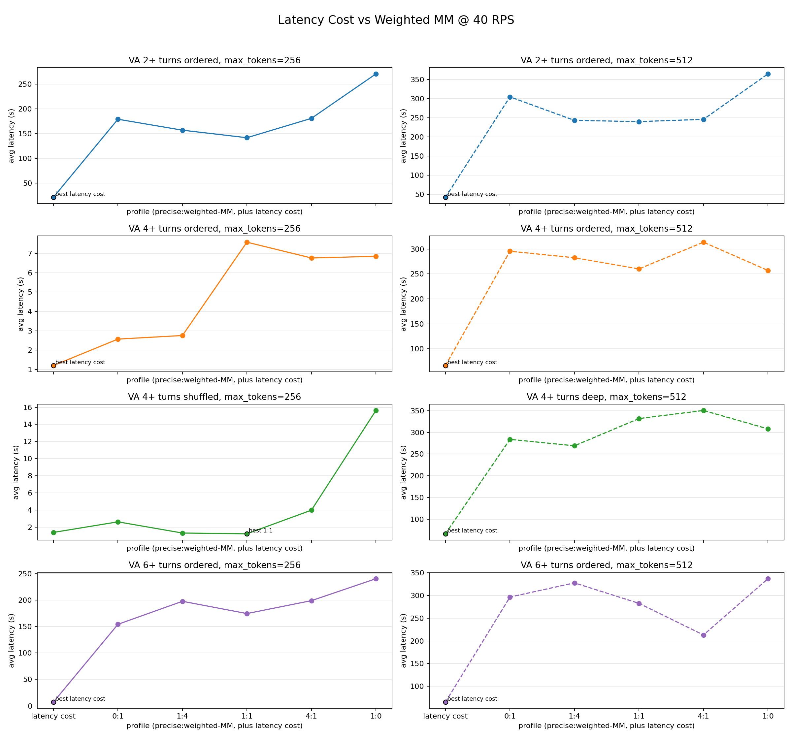

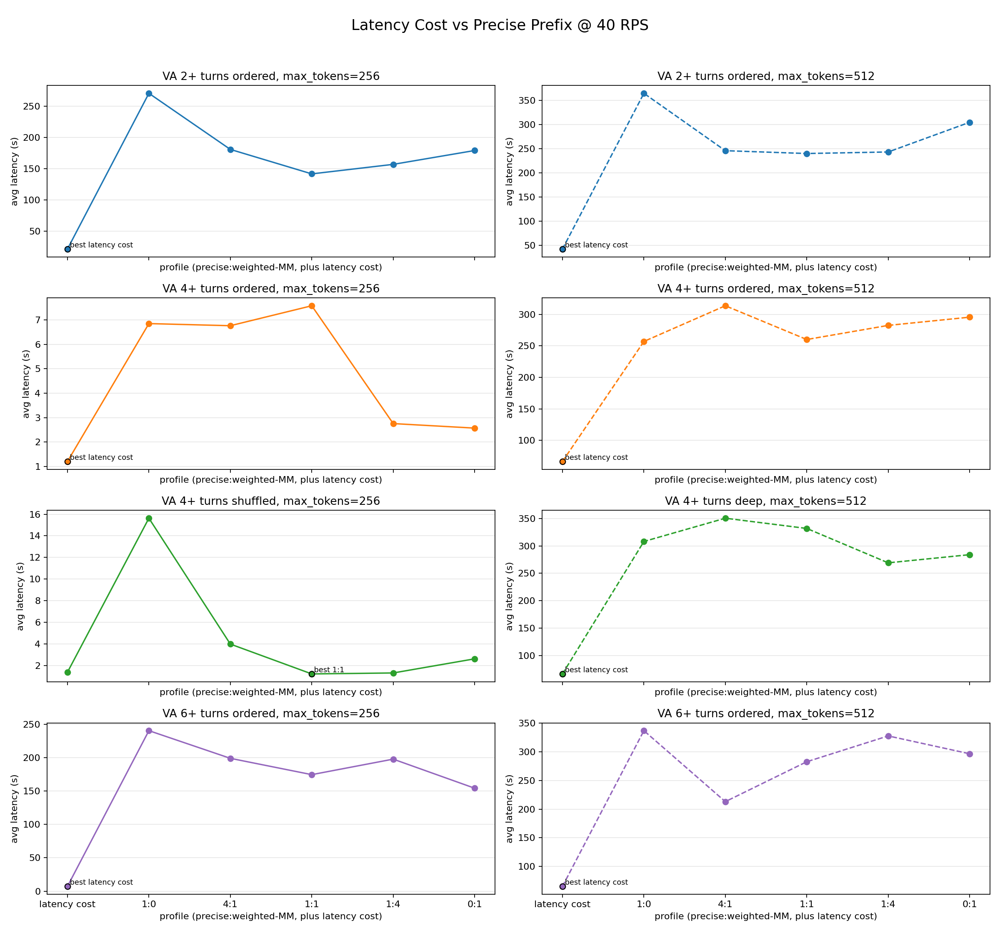

**Interpretation:** v1 **improves prediction error** (TTFT diff closer to zero). v1 e2e vs v0 is **similar** at overload (~+0.4s @ 30 RPS, ~+1.7s @ 50 RPS) — calibration ≠ routing objective. Details: [LATENCY_CALIBRATION_NOTES.md](LATENCY_CALIBRATION_NOTES.md).

---

### 7.2 Queue coefficient tuning

**Runs:** `20260520-lc-queue-tuning` · sole `latency_cost` · RPS 5–50.

| Variant | `queueMsPerRequest` | Other |
|---------|--------------------:|-------|
| v1 | 100 | baseline |
| B.1 | **200** | linear queue penalty |
| B.2 | 100 + `queueMsPerDepthSquared: 30` | rejected |
| B.3 | 250 | queued / follow-up |

**E2e latency @ key RPS (from [QUEUE_TUNING_ANALYSIS.md](QUEUE_TUNING_ANALYSIS.md))**

| RPS | v1 | B.1 | B.2 |
|-----|----|-----|-----|
| 20 | 1.57s | **1.48s** | **1.41s** |
| 30 | 11.76s | **11.20s** | 12.59s |
| 35 | **24.57s** | 25.41s | 27.77s |
| 40 | **42.23s** | 42.81s | 45.74s |

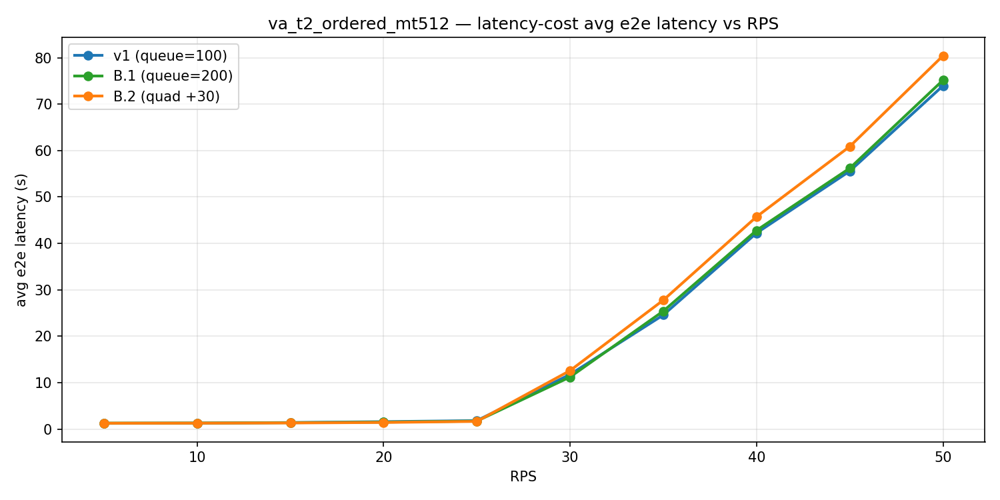

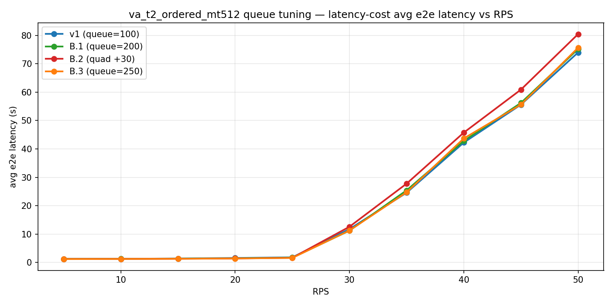

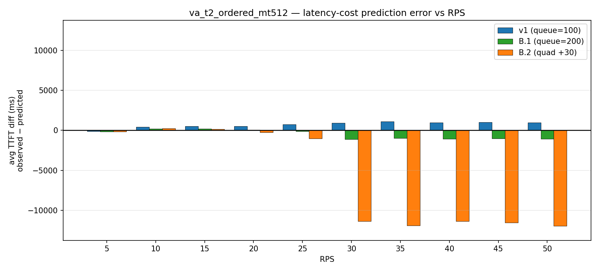

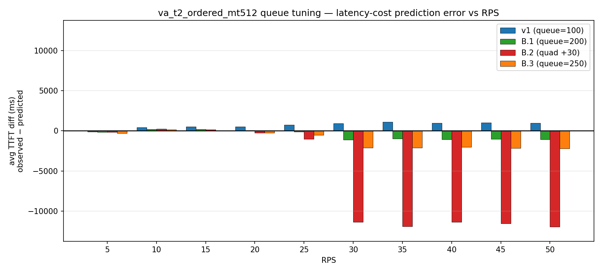

**Conclusion:** **B.2 quadratic rejected.** **B.1** helps at the **30 RPS knee**; v1 still best at **35+ RPS**. Hotspot pattern unchanged (~40% to `xtxqt`).

---

## 8. Synthetic shared_prefix compare (llm-d classical)

**Run:** `20260520-llmd-scorer-compare` · Job `llmd-scorer-compare-launcher` · **~147 min** · completed `2026-05-20T20:11:47Z`.

**PVC result dirs**

| Scorer | Path |
|--------|------|
| Precise-only | `/requests/inference-perf_1779299129_Shared_prefix_mm-scorer-lc-only_precise` |
| Latency-cost | `/requests/inference-perf_1779303913_Shared_prefix_mm-scorer-lc-latency_cost` |

### 8.1 Results summary

| Metric | `only_precise` | `latency_cost` |
|--------|---------------:|---------------:|
| Successes | **15,188** | **15,168** |
| Failures | 1,896 | 1,916 |
| Success rate | **88.9%** | **88.8%** |
| Failure mode | Mostly **timeouts** (~300s) at high RPS | Same |
| Failure prompt len (median) | ~2526 tokens | ~2527 tokens |

Prior failed run (6000+1200+1000 tokens): **0 successes**, **17,084** × `400 Bad Request` — not repeated after token fix.

### 8.2 Throughput and latency plots

**Per-scorer (inference-perf analysis)**

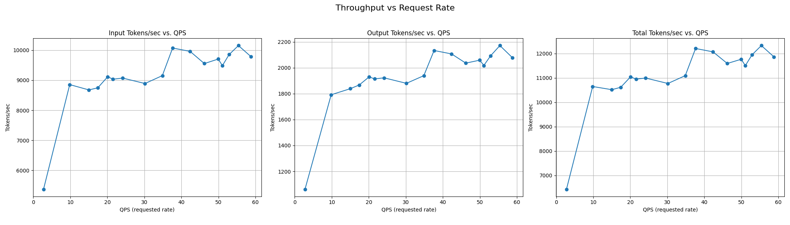

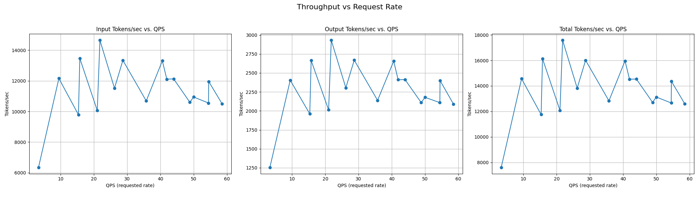

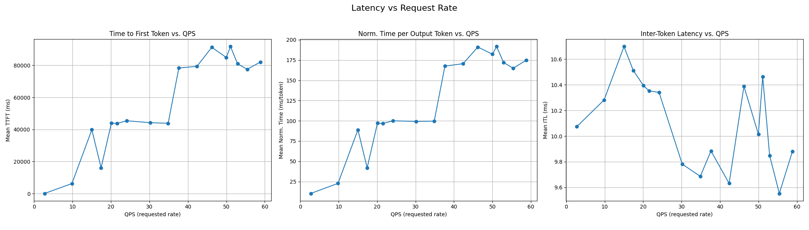

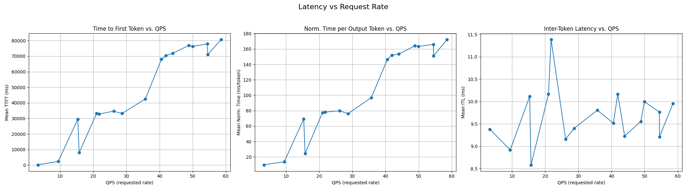

**Combined overlay (both scorers)**

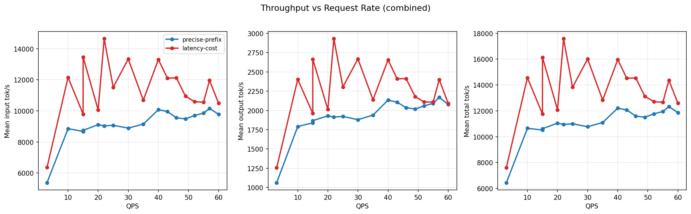

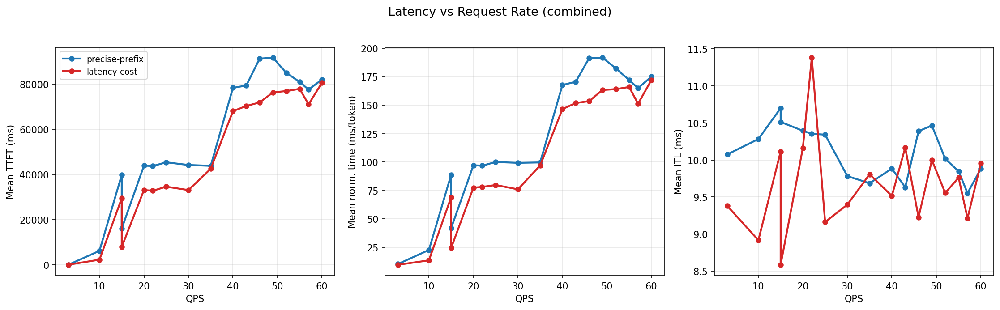

**Read combined charts**

- **≤30 QPS:** Similar TTFT; both scorers healthy.
- **35–60 QPS:** Failures rise; **latency-cost** shows **lower** mean TTFT / norm. time per token than precise-only.
- **Throughput:** Latency-cost has a sharper mid-ladder peak (~22 QPS); both plateau ~12k total tok/s at high QPS on this 4×2B stack.

Regenerate overlays: `scripts/plot_llmd_scorer_compare_combined.py`.

### 8.3 Deltas vs classical llm-d baseline (published guide)

| Dimension | Classical (guide) | This run |
|-----------|-------------------|----------|
| Model | Qwen3-32B | **Qwen2-VL-2B** |
| Replicas × GPU | **8 × TP2** (16 GPU) | **4 × TP1** (4 GPU) |
| `max-model-len` | ~16000 | **4096** |
| Prompt tokens | 6000 + 1200 + 1000 | **2000 + 400 + 500** |
| Execution | Laptop `run_only.sh` | **In-cluster Job** |
| Scorers | Single stack | **A/B** precise vs latency-cost |
| KV cross-pod | No (schedule to local cache) | **Same** |

Treat as **scorer comparison on mm-scorer-lc**, not reproduction of published Qwen3-32B curves.

---

## 9. Configuration reference

| Purpose | Path |
|---------|------|
| Latency-cost EPP | `configs/sole-scorer-benchmark/epp-latency-cost.yaml` |
| Precise-only EPP | `configs/sole-scorer-benchmark/epp-only-precise.yaml` |
| Queue B.1 / B.2 / B.3 | `configs/sole-scorer-benchmark/epp-latency-cost-b*.yaml` |
| Shared_prefix template | `configs/llmd-classic-benchmark/guygir-shared-prefix-template.yaml` |
| Compare launcher Job | `configs/llmd-classic-benchmark/job-scorer-compare.yaml` |
| Cache reset | `scripts/reset_vllm_caches.py` |
| Combined plots | `scripts/plot_llmd_scorer_compare_combined.py` |

---

## 10. Reproducibility

```bash
# VisionArena sole-scorer RPS grid
./scripts/start_cluster_sole_scorer_rps_sweep.sh

# Latency-cost vs static @ 20/40 RPS (VA)
./scripts/start_cluster_va_lc_sweep.sh   # see scripts/ for exact entrypoints

# Queue tuning
./scripts/start_cluster_queue_tuning.sh

# Synthetic shared_prefix A/B
./scripts/start_cluster_llmd_scorer_compare.sh

# Regenerate combined PNGs from PVC stage JSON
python3 scripts/plot_llmd_scorer_compare_combined.py \
  --precise-dir <path-to-only_precise-results> \
  --latency-cost-dir <path-to-latency_cost-results> \
  --output-dir results/20260520-llmd-scorer-compare/artifacts
```

Cluster copies: `oc cp guygir/llmdbench-harness-launcher:/requests/inference-perf_* ...`

---

## 11. Recommendations

1. **20 RPS VisionArena (static):** Default **`2:1` or `8:1`** precise:MM; baseline **`only precise`**.
2. **30–40+ RPS / overload:** Prefer **`latency-cost-scorer`** over new static ratios; consider **`queueMsPerRequest: 200`** (B.1) near knee, v1 at 35+.
3. **Coefficients:** Re-fit from `latency-observer` logs after production traffic shape is known; do not confuse predictor fit with e2e SLO.
4. **Classical parity:** To match published baseline, need **8× Qwen3-32B**, **original token lengths**, and **KV-events EPP** — separate effort from this report.
5. **Fairness:** Monitor pod skew (`xtxqt` ~40%); tune queue penalty if fairness SLOs require it.
6. **PR #901:** Wait for Rahul’s commits before further MM scorer review; latency work stays on `latency-cost-scorer` branch.

---

## 12. Figure index (all PNGs)

Figures live under `for_agent_work/benchmarks/results/` (relative paths in this doc). View on GitHub with this branch checked out.

| # | Section | File |
|---|---------|------|
| 1 | [§6.1](#61-weighted-mm-ratio-sweep-mixed-workloads) | `20260517-060043/weight_sweep.png` |
| 2 | §6.1 | `20260517-060043/weight_sweep_subplots.png` |
| 3 | [§6.2](#62-unweighted-mm-ratio-sweep) | `20260517-unweighted-190505/unweighted_sweep_subplots.png` |
| 4 | [§6.3](#63-visionarena-only-20-rps) | `20260518-va-weighted-parallel/artifacts/visionarena_weighted_sweep_subplots.png` |
| 5 | §6.3 | `20260518-va-unweighted-parallel/artifacts/visionarena_unweighted_sweep_subplots.png` |
| 6 | [§6.4](#64-visionarena-only-40-rps) | `20260518-va-weighted-40rps/artifacts/visionarena_weighted_40rps_subplots.png` |
| 7 | §6.4 | `20260518-va-unweighted-40rps/artifacts/visionarena_unweighted_40rps_subplots.png` |
| 8 | [§6.5](#65-sole-scorer-rps-grid) | `20260519-sole-scorer-va-t2-rps/artifacts/latency_vs_rps.png` |
| 9 | §6.5 | `20260519-sole-scorer-va-t2-rps/artifacts/pod_distribution_count.png` |
| 10 | §6.5 | `20260519-sole-scorer-va-t2-rps/artifacts/pod_distribution_weighted.png` |
| 11 | [§7.1](#71-coefficient-calibration) | `20260519-lc-calibration-va-t2-rps/artifacts/latency_vs_rps.png` |
| 12 | §7.1 | `20260519-lc-calibration-va-t2-rps/artifacts/ttft_diff_vs_rps.png` |
| 13 | §7.1 | `20260519-lc-calibration-va-t2-rps/artifacts/pod_distribution_count.png` |
| 14 | [§6.6](#66-latency-cost-vs-static-ratios) | `20260519-va-lc-20rps/artifacts/visionarena_latency_vs_weighted_20rps_subplots.png` |
| 15 | §6.6 | `20260519-va-lc-20rps/artifacts/visionarena_latency_vs_precise_20rps_subplots.png` |
| 16 | §6.6 | `20260519-va-lc-40rps/artifacts/visionarena_latency_vs_weighted_40rps_subplots.png` |
| 17 | §6.6 | `20260519-va-lc-40rps/artifacts/visionarena_latency_vs_precise_40rps_subplots.png` |
| 18 | [§7.2](#72-queue-coefficient-tuning) | `20260520-lc-queue-tuning/artifacts/latency_vs_rps.png` |
| 19 | §7.2 | `20260520-lc-queue-tuning/artifacts/latency_vs_rps_all.png` |
| 20 | §7.2 | `20260520-lc-queue-tuning/artifacts/ttft_diff_vs_rps.png` |
| 21 | §7.2 | `20260520-lc-queue-tuning/artifacts/ttft_diff_vs_rps_all.png` |
| 22 | [§8.2](#82-throughput-and-latency-plots) | `20260520-llmd-scorer-compare/artifacts/only_precise_throughput_vs_qps.png` |
| 23 | §8.2 | `20260520-llmd-scorer-compare/artifacts/latency_cost_throughput_vs_qps.png` |
| 24 | §8.2 | `20260520-llmd-scorer-compare/artifacts/only_precise_latency_vs_qps.png` |
| 25 | §8.2 | `20260520-llmd-scorer-compare/artifacts/latency_cost_latency_vs_qps.png` |
| 26 | §8.2 | `20260520-llmd-scorer-compare/artifacts/combined_throughput_vs_qps.png` |
| 27 | §8.2 | `20260520-llmd-scorer-compare/artifacts/combined_latency_vs_qps.png` |


---

*Document generated from cluster runs through 2026-05-20. For day-to-day scorer design, start with [LATENCY_COST_SCORER.md](LATENCY_COST_SCORER.md); for MM weight sweeps, [MM_SCORER_WEIGHT_PROFILE_BENCHMARK.md](MM_SCORER_WEIGHT_PROFILE_BENCHMARK.md).*
